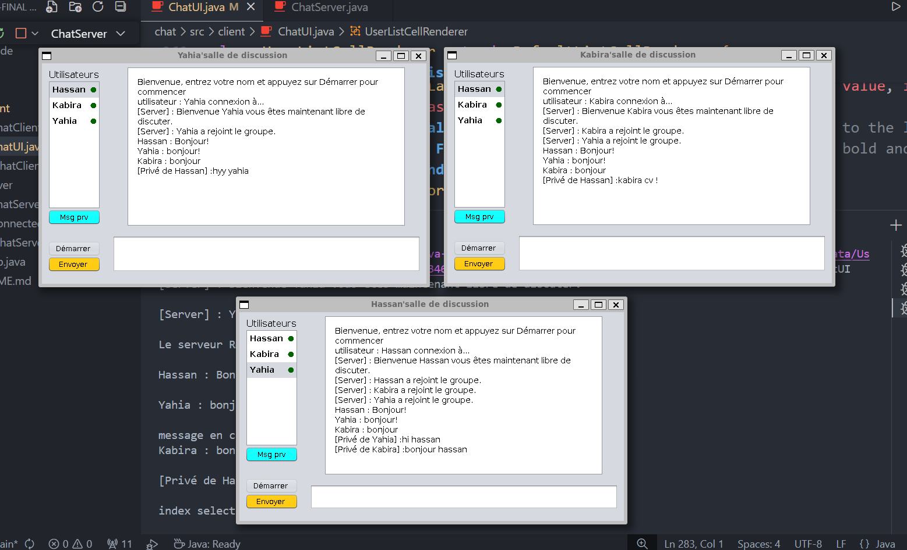
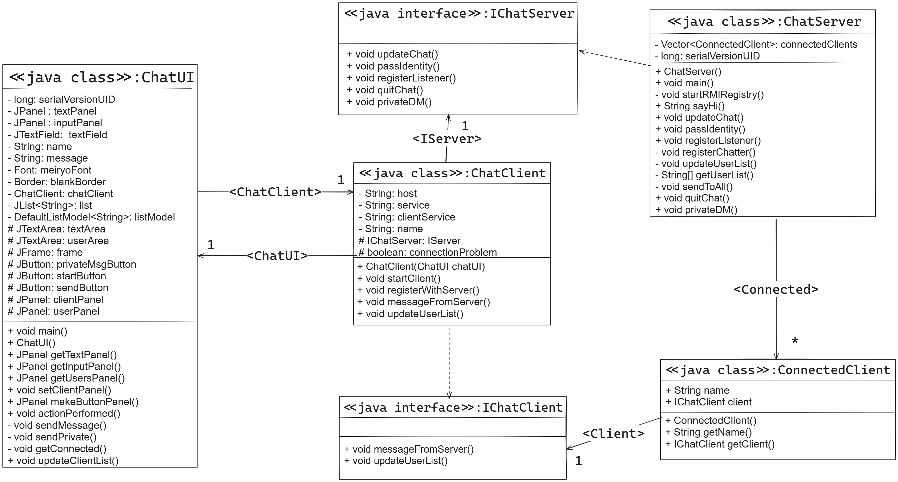

# Simple Chat Application with Java RMI

## Table of Contents

- [Introduction](#introduction)
- [Features](#features)
- [Architecture](#architecture)
- [Installation](#installation)
- [Usage](#usage)
- [Technical Challenges](#technical-challenges)
- [Contributing](#contributing)
- [License](#license)
- [Contact](#contact)

## Introduction

Welcome to our Simple Chat Application developed using Java RMI. This project demonstrates a basic real-time chat system where users can interact through a centralized server. The application leverages Java RMI for efficient client-server communication, offering both public and private messaging functionalities.



## Features

- **Real-time Messaging**: Chat with other users in real time.
- **Public and Private Messages**: Send messages to all users or privately to a specific user.
- **User Nicknames**: Choose a nickname upon connection.
- **Simple User Interface**: Easy-to-use interface for quick interaction.
- **Join/Leave Chat**: Connect or disconnect from the chat server at any time.

## Architecture

The application follows a client-server architecture using Java RMI. Here's a brief overview:

- **ChatServer**: Manages messaging logic and client connections.
- **ChatClient**: Connects to the server and allows user interaction via a graphical interface.
- **ChatUI**: Provides the graphical user interface for users.
- **ConnectedClient**: Manages connected clients and facilitates private messaging.

### UML Diagram

### RMI Architecture


## Installation

### Prerequisites

- Java Development Kit (JDK) 8 or higher
- Apache Ant (optional, for building the project)

### Steps

1. **Clone the repository**

```bash 
  git clone @ https://github.com/Ilham-Syed/Java-RMI-Chat-Application
```
```bash
  cd RMI-Final
```

2. **Compile the project**
```bash
javac -d bin src/**/*.java
```
3. **Start the RMI registry**
```bash
rmiregistry
```
4. **Run the server** 
```bash
java -cp bin server.ChatServer
``` 
4. **Run the client**  
```bash
java -cp bin client.ChatClient
```

**Note!**: After clonig the project, then from you IDE do the following this steps:
1. Run `ChatServer.java` 
2. Run `ChatUI.java`

## Usage
1. **Start the server**: Ensure the server is running and RMI registry is active.
2. **Launch the client**: Open multiple clients to simulate multiple users.
3. **Enter Nickname**: Enter a unique nickname for each client.
4. **Send Messages**: Use the input field to send public or private messages.
5. **Private Messaging**: select a specific user from the list , write your message and click the button "PRV MSG"

## Echnical Challenges
### Communication Issues
 - **Challenge**: Ensuring reliable communication between clients and the server.
 - **Solution**: Implementing Java RMI for direct and real-time communication.


